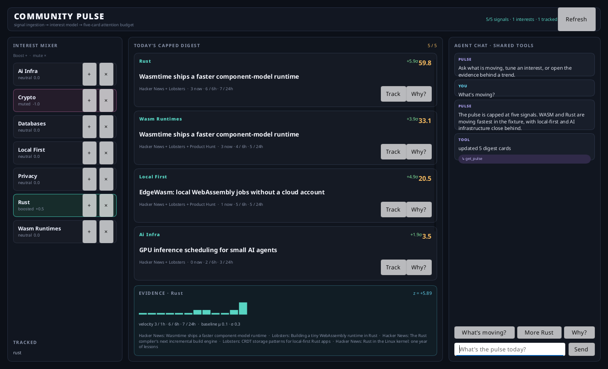

# Community Pulse

Community Pulse turns noisy public community feeds into a five-card digest. It
normalizes Hacker News, Lobsters, and Product Hunt; measures topic velocity
against a seven-day baseline; then reranks the shared trends with an explicit
interest mixer.

The desktop demo is built in Rust with [Slint](https://slint.dev/) and uses
[`lazily`](https://github.com/lazily-hub/lazily-rs) cells as the single source
of state for direct UI actions and agent tool calls.



A short [offline backup recording](demo/community-pulse-demo.mp4) is checked in
for interview-room fallback.

## One-command offline demo

```bash
cargo run -- --fixture --replay app
```

This path needs no network. `--fixture` replaces the selected SQLite database
with a time-relative, deterministic 30-post snapshot. `--replay` drives the
same four production tools with a local scripted agent, including incremental
chat deltas and visible tool-call chips.

Try these prompts:

- `What's the pulse today?`
- `More Rust, less crypto`
- `Why is WASM moving?`
- `Track WASM runtimes for me`

## CLI-first data story

```bash
# Deterministic capped digest
cargo run -- --fixture top

# Machine-readable output and evidence
cargo run -- --fixture top --json
cargo run -- --fixture explain wasm-runtimes

# Live ingestion, then launch the UI
cargo run -- ingest
cargo run -- app
```

The core is a library with no agent dependency. The CLI deliberately proves
the ingestion → normalization → scoring → attention-budget story before any UI
or model is involved.

## Live OpenAI-compatible chat

Copy `.env.example` into your shell configuration (the app does not parse or
commit `.env` files):

```bash
export PULSE_API_BASE=https://api.openai.com/v1
export PULSE_API_KEY=...
export PULSE_MODEL=gpt-4.1-mini
cargo run -- --fixture app
```

`PULSE_API_BASE` can point at any compatible streaming chat-completions
endpoint. The client accumulates fragmented streaming tool arguments, executes
the tool, appends its compact JSON result, and continues the response for up to
four tool rounds. If no API key is present, the app clearly announces and uses
the deterministic replay agent.

## The shared tool bridge

| Tool | Effect |
| --- | --- |
| `get_pulse(limit?)` | Returns a digest clamped to the five-card attention budget. |
| `set_interests(add[], remove[])` | Persists boost/mute weights and reranks immediately. |
| `explain_trend(id)` | Opens velocity, baseline, z-score, sparkline, and source evidence. |
| `subscribe_topic(topic)` | Adds a durable tracked topic for the personal-alert bridge. |

Buttons, topic chips, replay chat, and live chat all invoke this bridge. Every
mutation updates `lazily::ThreadSafeContext` sources; the derived status line is
a `lazily` computed value, so agent and UI state cannot fork.

Repeated `+` clicks step a topic through 0.5× weights up to 2.0; `×` toggles a
hard mute. That makes the interest vector visible and directly editable instead
of hiding personalization behind the model.

## Scoring

For each deterministic extracted topic, the engine records mentions over
1-hour, 6-hour, and 24-hour windows. It compares the current six-hour bucket to
27 preceding six-hour buckets (roughly seven days):

```text
z = (mentions_6h - baseline_mean) / max(baseline_stddev, 1)
velocity = 4·mentions_1h + 0.8·mentions_6h + 0.15·mentions_24h
trend = velocity·(1 + 0.25·max(z, 0)) + 0.5·distinct_sources
final rank = trend × interest_affinity
```

A negative interest weight mutes the topic. Positive weights boost it. The
result is always capped at five regardless of feed or user scale.

## Project map

- `src/engine.rs` — SQLite schema, normalization, windows, baseline, scoring,
  fixture, evidence, interests, and subscriptions
- `src/ingest.rs` — async adapters for HN Algolia, Lobsters JSON, and the
  Product Hunt Atom feed
- `src/reactive.rs` — `lazily` sources and derived UI status
- `src/tools.rs` — the four shared tools
- `src/chat.rs` — streaming compatible API loop and deterministic replay
- `ui/app.slint` — topic mixer, capped cards, evidence, and chat
- `docs/demo-script.md` — the 60–90 second operator script
- `docs/case-study.md` — decision and outcome brief
- `docs/production.md` — 100k-user and mobile path
- `scripts/record-demo.sh` — reproducible X11 screenshot/video capture

See [architecture.md](docs/architecture.md) for the boundaries and concurrency
model.

## Quality gates

```bash
make check
```

CI enforces formatting, Clippy with warnings denied, all targets, and all
tests. The fixture test also launches the compiled `pulse` binary and verifies
that JSON output contains exactly five cards.

## Scope

Chat and visual composition are the complete demo. Voice is intentionally a
separate lens over the same bridge, not a prerequisite. The production brief
describes that seam without pulling audio, VAD, resampling, or media routing
risk into this repository.

Licensed under MIT.
